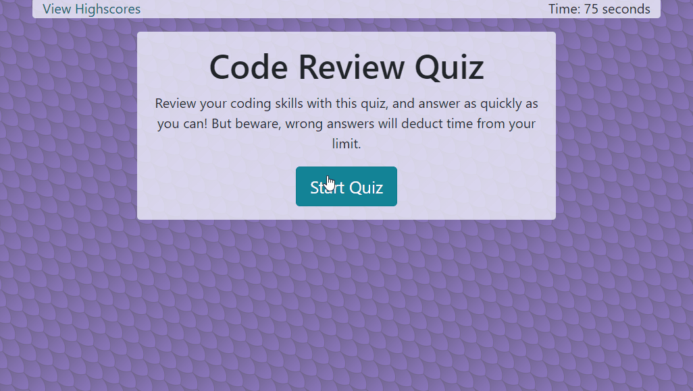

# CodeCheck
Fourth homework assignment for uw-sea-fsf-pt-08-2020-u-c [a flashcard-style quiz to review coding information.][1]

## Table of Contents

* [Description](#description)
  * [Building the Quiz](#building-the-quiz)
  * [Tallying the Scores](#tallying-the-scores)
  * [Built With](#built-with)
* [Contact](#contact)

## Description 
For this assignment, we were asked to make an interactive quiz on JavaScript concepts, using Bootstrap components to build it from scratch.

### Building the Quiz
The example quiz given used a timer as its end mechanic, and deducted time for each incorrect answer. I kept that same pattern and added a progress bar for the countdown. With Bootstrap's responsive classes, I made the progress bar disappear on smaller screens to avoid having a cluttered interface.

The questions are stored as objects within an array, and written to the webpage one at a time by JavaScript DOM manipulation. Within each question object we find the question itself, the 4 answer choices (as another object), and a trait to store which answer is correct. Using this structure in the array makes it easier to display the questions in a randomized order and be certain the corresponding answers will always come up.

I wanted the quiz to flow seamlessly without obvious repetition, so I found a function online that would randomize objects within an array. I didn't want to use a random number generator to select questions to display, as that wouldn't guarantee the user getting all unique questions first before reaching any repeated ones. Instead,shuffling the array and counting through every question in it gives the user a different experience each time they play the game. 

To avoid having the game suddenly stop when the user exhausted the full list of questions, I set the question counter (used to iterate through the array) to go back to index 0 and re-shuffle the list when it reached the end of the array. This way, if a user is clicking through questions too quickly and doesn't manage to run out of time by hitting wrong answers they won't have a broken experience.

I made the list of questions by taking a few existing JavaScript quizzes online (from places like [w3schools.com](https://www.w3schools.com/js/js_quiz.asp)) and using them as inspiration for what topics to include. I may add more questions later, but there are currently 14 to work through. 

### Tallying the Scores
When a player finishes the game, their score is diplayed in a form element that also asks for their initials. (I limited the text box to 5 characters to accommodate longer names, but avoid having inputs that were too long for the layout of the scoreboard page to still look nice.) The list of scores is kept as an array of objects, so the new score earned is converted into an object with the appropriate traits. The game then pulls any existing high scores out of local storage and parses them using JSON into a high score array. If no existing scores are found, it creates an array to set up the proper structure. The new score is pushed to our score array, and the whole list is converted back to a string with JSON and re-stored in localStorage.

By using localStorage, the game keeps track of a player's high scores on their computer. This persists between sessions and across pages, which allows us to have a separate page for the high score list. I created a separate .js file for the scoreboard, so its page wouldn't need to load a longer file full of scripts and location references that don't apply to it.

When the scoreboard page is loaded, JavaScript pulls the score list out of storage (if it exists) and converts it back into an array with JSON. The array is then sorted, from high scores to low. Each object is then listed on the scoreboard page with DOM manipulation. The user is given the choice of erasing all stored scores with one button, or returning to the quiz page with another. It's a simple application, but one that didn't need to be over-complicated.

### Built With

* JavaScript
* Bootstrap
* HTML
* CSS

## Contact

Zii (Christina) Engelhardt - cjengelhardt@gmail.com

Project Link: [https://ziieng.github.io/ResponsivePortfolio/](https://ziieng.github.io/CodeCheck/)

Repository Link: [https://github.com/ziieng/CodeCheck](https://github.com/ziieng/CodeCheck)

[1]:<https://ziieng.github.io/CodeCheck/>